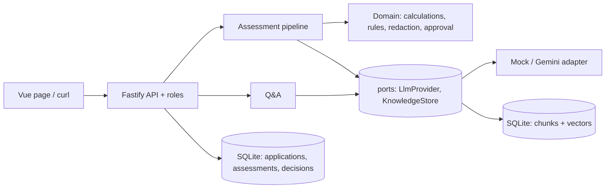

# Design

## Architecture

Two stores: `chunks` (trusted policy, searchable) and `applications` (untrusted customer packs, never embedded or searched).

Layers: `src/domain` imports nothing from app/infra (enforced by an ESLint rule); `src/app` depends on interfaces in `ports.ts`; `src/infra` implements them. `src/infra/bootstrap.ts` is the only wiring point.

## Chunking

By clause (CP-4.1, PM-2, PS-3, C-2), one chunk per clause or table row, not fixed-size windows. A clause is what an officer cites, so one chunk gives one exact citation, and the 2024/2025 editions differ clause by clause. Each chunk stores source file, page, clause id, edition, effective dates and in-force status. Chunk id = `docId:clauseId`, so re-ingesting replaces rather than duplicates. Edge cases handled: one-line table rows (CP-3.4) are kept; a bare title such as "CP-4. Affordability" is dropped; the CP-13 comparison table is not split. Pricing CSV rows become one sentence each.

## How the policy edition is selected

`selectEdition()` (`src/domain/policy.ts`) picks the edition whose `[effectiveFrom, effectiveTo)` contains the application date; exactly one must match or `PolicyEditionNotFound` is raised and the case is referred. Retrieval is then filtered to that edition plus documents in force on that date, so the superseded Circular 2024/07 cannot be cited for a 2025 application. For questions, a year in the question picks the edition ("2024" -> CP-2024); both years -> search both; no year -> the edition in force.

## How the LLM is kept away from arithmetic

- Installment, DBR, maximum amount, ages and all rule results come from pure functions with `decimal.js` (half-up rounding, exact DBR comparison).
- The LLM only extracts four values (and the code verifies them) and writes memo prose. The memo prompt forbids digits; the model uses placeholders like `[[installment]]`. `validateMemo` rejects any text that still contains a digit after removing placeholders and clause ids, and the pipeline falls back to a deterministic summary. Code substitutes the numbers.
- Extraction check: the quoted text must appear in the cited section, the value must appear in the quote, and income must equal gross minus deductions from the certificate's own table. Otherwise `UnverifiedExtraction` -> refer.
- Interest rates come from the pricing CSV at run time.

## Protected attributes

`redactForm` drops gender, marital status, religion, nationality (plus name, ID, mobile) from the structured record; `redactText` removes them from free text, which matters because salary certificates contain "Mr/Ms" and "his/her". The log records the removed fields. The fairness test (`tests/pipeline.test.ts`) changes gender, marital status, religion, nationality, name, title and pronouns in an application and asserts the full result is identical and the text sent to the LLM is identical. I broke the redaction on purpose once to confirm the test fails. Limit: the word list is finite; an unknown nationality word inside certificate text would pass through.

## Switching LLM provider

1. Add `src/infra/llm/<name>.ts` implementing `LlmProvider` (`complete`, `embed`).
2. Add one `case` in `src/infra/llm/index.ts`.
3. Set `LLM_PROVIDER=<name>` plus its keys, then re-run `npm run ingest` (vectors are stored per embedding model).
   No domain, pipeline or API file changes.

## Decisions on ambiguities in the brief

- **Application intake:** pick one of the five packs loaded by `npm run seed` into the untrusted table. No upload endpoint, so no file-upload surface.
- **Roles:** Loan Officer, Credit Officer, plus Senior Credit Officer (see README). Four-eyes (PM-3): the preparer cannot approve or reject. Referred files require a Senior (PM-4). A decline recommendation can only be rejected/confirmed, not approved.
- **Outcome precedence:** any hard rule failure -> `decline`; else any `refer` (e.g. bureau score below 600) -> `refer`; else DBR failure -> `offer_reduced_amount` (CP-4.3) when the maximum amount is at least the product minimum; else `approve`. Hidden instructions in a customer document force `refer` (PM-7) even if every number passes.
- **CP-4.4:** DBR is reported as `not_assessed` when eligibility fails, but the figures are still computed and shown.
- **Brief inconsistency:** Appendix E.2 shows APP-001 with maximum eligible amount 382,000 under CP-2025. 382,000 is the 50% (2024) figure from the S2 worked example. Under CP-2025 (45%) the correct value is **330,000**, which is what the system and tests produce. The 8,630.39 installment and 42.10% DBR match.
- **Maximum tenor:** Circular 2025/02 allows 72 months, but CP-14 and PS-3 keep 60 until the product sheet is updated; the lower value applies.
- **Pricing document id:** the CSV is `PT-2025-01` but effective from 2024-01-01; citations use the document id.

## What was left out on purpose (honest list)

- **Not run live:** the Gemini adapter, `docker compose`.
- **Not semantic by default:** the offline embedder is lexical. Semantic quality needs a real embedding provider and re-running the evaluation.
- **Not checked:** probation status (CP-3.1) and "facility in default" (CP-6) are not extracted or enforced; employer-is-the-bank referral (CP-8) is not detected.
- No hybrid search, re-ranking, streaming, offer letter, cost tracking, rate limiting on login, token revocation, or file upload.
- Vector search is brute force over about 80 chunks in SQLite; a real vector store would be needed at scale.
- UI is a single static Vue page with no styling.

## What I would add with more time

Run the evaluation against a real embedding model and compare; hybrid BM25 + vector with before/after numbers; extract probation and default flags; login rate limiting; a second provider (Ollama).
